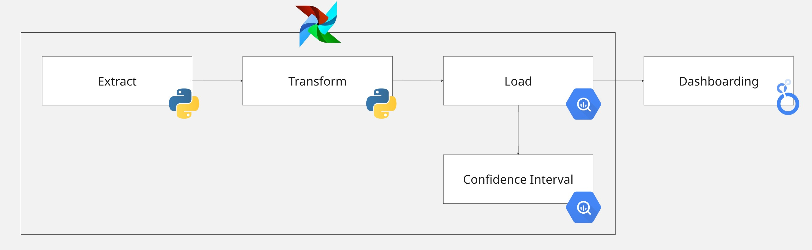

# 🕹️ Digital Interest DAG

`Extract`, `Transform` dan `Load` pipeline ini menggunakan `Airflow` dan dilanjutkan dengan mengkoneksikannya ke `interactive dashboard (Looker)`.

## 🔗 Workflow

`extract` >> `transform` >> `load` >> `confidence interval`

### 🖇️ Extract
Tugas `extract` dalam workflow ini adalah untuk membaca file digital_customer.csv. Data tersebut terdiri dari 9 kolom dan 300 baris. Kolom tersebut Nama Lokasi,	Jam Login,	Nama,	Email,	No Telpon,	Tahun Lahir,	Merek HP,	Minat Digital, dan	Tipe Lokasi.

### 🖇️ Transform
Tugas `extract` dalam workflow ini adalah untuk mengubah kolom sebelumnya menjadi kolom-kolom baru, guna mempermudah analisis selanjutnya. Kolom data tersebut dijelaskan sebagai berikut:
<table>
    <thead>
      <tr>
        <td>Kolom</td>
        <td>Keterangan</td>
      </tr>
    </thead>
    <tbody>
    <tr>
      <td>Nama Lokasi</td>
      <td>Lokasi pelanggan login</td>
    </tr>
    <tr>
      <td>Jam Login</td>
      <td>Jam Login pelanggan</td>
    </tr>
    <tr>
      <td>Nama</td>
      <td>Nama pelanggan</td>
    </tr>
    <tr>
      <td>Email</td>
      <td>Email pelanggan</td>
    </tr>
    <tr>
      <td>No Telpon</td>
      <td>No Telpon pelanggan</td>
    </tr>
    <tr>
      <td>Tahun Lahir</td>
      <td>Tahun Lahir pelanggan</td>
    </tr>
    <tr>
      <td>Merek HP</td>
      <td>Merek HP pelanggan</td>
    </tr>
    <tr>
      <td>Minat Digital</td>
      <td>Seberapa tertarik pelanggan dalam digital (rendah, menengah, tinggi)</td>
    </tr>
    <tr>
      <td>Tipe Lokasi</td>
      <td>Tipe Lokasi pelanggan</td>
    </tr>
    <tr>
      <td>Tanggal Login</td>
      <td>Tanggal Login pelanggan</td>
    </tr>
    <tr>
      <td>Bulan Login</td>
      <td>Bulan Login pelanggan</td>
    </tr>
    <tr>
      <td>Hari Login</td>
      <td>Hari Login pelanggan</td>
    </tr>
    <tr>
      <td>Weekday/end</td>
      <td>Pelanggan login di weekday/weekend</td>
    </tr>
    <tr>
      <td>Status Waktu</td>
      <td>Status waktu pelanggan (di jam sibuk/tidak)</td>
    </tr>
    <tr>
      <td>Usia</td>
      <td>Usia Pelanggan</td>
    </tr>
    <tr>
      <td>Generasi</td>
      <td>Generasi pelanggan</td>
    </tr>
    <tr>
      <td>OS HP</td>
      <td>Sistem operasi HP pelanggan</td>
    </tr>
    <tr>
      <td>Skor Minat Digital</td>
      <td>Skor minat digital pelanggan (1: rendah, 2: sedang, 3: tinggi)</td>
    </tr>
    </tbody>
</table>

### 🖇️ Load
Data yang sudah bersih dan rapi, selanjutnya dilakukan `load` ke dalam `BigQuery`. Load ini bertujuan untuk memudahkan analisis data selanjutnya menggunakan SQL.

### 🖇️ Confindence Interval
`Confidence Interval (CI)` adalah rentang nilai yang digunakan untuk memperkirakan parameter populasi (seperti rata-rata) berdasarkan data sample.
Dalam kasus ini kita menghitung `CI` dari skor minat digital pelanggan menggunakan SQL di `BigQuery`.

## 🔗 Dashboard
Setelah proses ETL pipeline selesai, data yang berada dalam `BigQuery` dikoneksikan ke dashboard (Looker). Hasil dashboard dapat dilihat di [Dashboard](https://lookerstudio.google.com/reporting/c3e65a4c-1272-45c4-a8ae-c356bfd299ad) 

## 🔗 Presentation
Hasil dashboard dipaparkan menggunakan presentasi yang visual dan interaktif, dapat dilihat di [](https://www.canva.com/design/DAGlp-HZa5Y/hcUdnfjyuLiqn015bE7c4A/edit?utm_content=DAGlp-HZa5Y&utm_campaign=designshare&utm_medium=link2&utm_source=sharebutton)

## 🔗 Installation
  **Clone the repository:**
  ```bash
  git clone https://github.com/rosaihzaa/digital-interest-dag.git
  ```
  **Create a Virtual Enviroment:**
  ```bash
  python -m venv venv
  source venv/bin.activate
  ```
  **Install Dependencies:**
  ```bash
  pip install -r requirements.txt
  ```
  **Authentication of your Google Cloud:**
  ```bash
  gcloud auth activate-service-account
  ```
  **Install Apache Airflow:**
  ```bash
  pip instll apache-airflow
  ```
  **Initialize Airflow Database:**
  ```bash
  airflow db init
  ```
  **Starting your Airflow**
  ```bash
  airflow webserver --port 8080
  airflow scheduler
  ```
  Setelah melakukan step di atas, ETL dapat dipantau dan dilakukan trigger DAG pada airflow web UI di [http://localhost:8080](http://localhost:8080)


